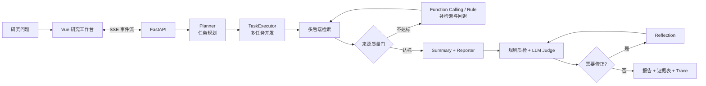
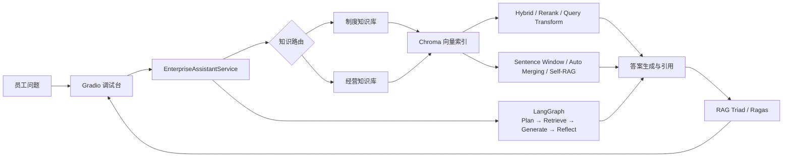

# Agentic AI Engineering

面向真实工程场景的 Agent 与 RAG 作品集，包含一套可评估的深度研究 Agent，以及一套支持多路知识检索与反思闭环的企业知识库助手。两个项目均提供可运行界面、完整测试和质量评估链路。

> 技术栈：Python · FastAPI · LangGraph · Function Calling · Chroma · LangChain · LlamaIndex · Ragas · Vue 3 · Gradio

## 项目导航

| 项目 | 定位 | 核心能力 | 详细文档 |
| --- | --- | --- | --- |
| [Deep Research Agent](deep-research-agent/) | 面向复杂问题的可信研究工作台 | 任务规划、并发检索、Function Calling 补检索、证据治理、质检与反思 | [项目说明](deep-research-agent/README.md) · [核心流程](deep-research-agent/docs/core-workflow.md) |
| [Enterprise RAG Assistant](enterprise-rag-assistant/) | 面向企业制度与经营资料的 Agentic RAG 助手 | 知识路由、混合检索、高级 RAG、LangGraph 编排、RAG Triad / Ragas 评估 | [项目说明](enterprise-rag-assistant/README.md) · [架构文档](enterprise-rag-assistant/docs/architecture.md) |

## Deep Research Agent

将一次研究请求拆解为可观测、可评估、可修正的 Agent 工作流；重点解决来源质量、引用漂移、并发事件流和模型输出不稳定等工程问题。



核心技术亮点：

- 编排 `Planner → Research → Report → Evaluate → Reflect` 五阶段 Agent 工作流，以节点契约串联规划、执行、评估与修订，形成闭环研究链路。
- 设计任务级并发与 SSE 事件驱动模型，通过失败隔离、生命周期事件和异常收敛保障长任务可观测性。
- 构建检索治理层，统一多查询聚合、去重、来源分级与质量门；低质结果触发 Function Calling 补检索，并以规则策略可靠降级。
- 建立证据质量闭环，以稳定引用 ID 贯通正文、参考文献与证据表，由规则质检、LLM Judge 和 Reflection 驱动修订与回归验证。


真实运行：并行完成 4 个研究任务、汇聚 20 条来源，引用质检得分 100。

## Enterprise RAG Assistant

围绕企业制度与经营资料构建多知识库问答系统，以统一服务层编排路由、检索、生成、引用和评估，并提供 LangGraph Agentic RAG 模式。



核心技术亮点：

- 抽象统一问答服务与知识路由层，解耦业务知识和 LangChain / LlamaIndex / LangGraph 实现，标准化上下文、引用与调试轨迹。
- 构建可插拔高级检索矩阵，覆盖 Hybrid（BM25 + Vector）、Query Rewrite、HyDE、Query2Doc、Query Fusion + RRF 与 LLM Rerank。
- 以 Parent-Child、Sentence Window、Auto-Merging 重构上下文，结合 Self-RAG 与 LangGraph 串联规划、检索、反思和结果修订。
- 建立分层质量评估体系，以 RAG Triad 诊断单次链路、Ragas 对比离线策略，量化上下文相关性、回答忠实度与召回质量。


真实运行：基于 LangGraph Agent 完成意图路由、知识检索、反思修订与证据引用。

## 本地启动

环境要求：Python 3.10+、Node.js 18+。两个子项目使用独立虚拟环境，避免依赖互相影响。

### 1. Deep Research Agent

```bash
cd deep-research-agent
python3.10 -m venv .venv
.venv/bin/pip install -U pip
.venv/bin/pip install -r requirements.txt
cp ../.env.example ../.env

cd src/frontend
npm ci
cd ../..
.venv/bin/python dev.py
```

打开 `http://127.0.0.1:5174`。未配置 Tavily / SerpApi 时，搜索会降级到 DuckDuckGo。

### 2. Enterprise RAG Assistant

```bash
cd enterprise-rag-assistant
python3.10 -m venv .venv
.venv/bin/pip install -U pip
.venv/bin/pip install -r requirements.txt
cp ../.env.example ../.env
.venv/bin/python app.py
```

打开 `http://127.0.0.1:7860`。首次启动会根据示例知识文档构建本地 Chroma 索引。

## 测试与评估

### Deep Research Agent

```bash
cd deep-research-agent
.venv/bin/python -m unittest discover -s tests -v
.venv/bin/python benchmarks/agent_eval.py

# 启动后端后执行真实固定问题集与回归门禁
.venv/bin/python benchmarks/runner.py --backend duckduckgo
.venv/bin/python benchmarks/regression_gate.py benchmarks/runs/<run_id>/metrics.json
```

### Enterprise RAG Assistant

```bash
cd enterprise-rag-assistant
.venv/bin/python -m unittest discover -s tests -v

# 需配置模型密钥：对比 Hybrid 与 LangGraph Agent 策略
.venv/bin/python run_eval.py
```

评估体系与指标定义见 [统一测试与评估说明](docs/testing-and-evaluation.md)。

## 文档

- [整体架构与设计取舍](docs/architecture.md)
- [测试、评估与回归策略](docs/testing-and-evaluation.md)
- [Deep Research Agent 完整文档](deep-research-agent/docs/README.md)
- [Enterprise RAG 检索策略](enterprise-rag-assistant/docs/rag-strategies.md)
- [Enterprise RAG 评估与调试](enterprise-rag-assistant/docs/evaluation-and-debugging.md)

## 安全说明

仓库不包含任何真实密钥、模型凭证、运行日志、研究产物或本地向量索引。请从 `.env.example` 创建本地 `.env`，切勿提交凭证。
