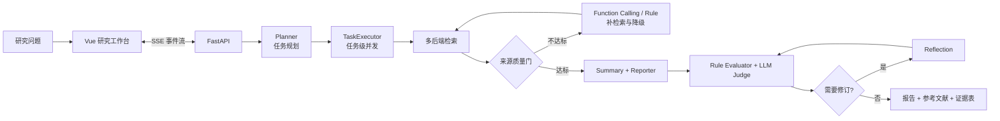

# Deep Research Agent

一套面向复杂问题的可信深度研究 Agent。系统将开放式研究请求拆解为可并发执行的子任务，经过多源检索、来源治理、报告生成、质量评估与反思修订，最终输出带稳定引用、参考文献和证据表的研究报告。

它关注的不只是“让模型生成一篇长文”，而是如何把一次长耗时、强依赖外部信息的研究过程建设成**可观测、可评估、可修正、可回归**的工程链路。

## 系统架构



## 五阶段 Agent 工作流

| 阶段 | 核心职责 | 工程设计 |
| --- | --- | --- |
| Planner | 将研究主题拆成互补、可执行的子任务 | 结构化解析任务边界，为并发执行建立稳定输入 |
| Research | 多查询检索、来源过滤、任务总结 | 任务间并发、任务内按 `search → summary` 有序执行 |
| Report | 汇总各任务结论并生成研究正文 | 模型负责内容生成，程序负责引用与证据组装 |
| Evaluate | 检查结构、引用、来源和语义质量 | 规则评估与可选 LLM Judge 组合，输出可解释指标 |
| Reflect | 根据质检结果定向修订报告 | 最多执行一次修订并复检，控制成本与循环稳定性 |

## 核心技术设计

### 1. 任务级并发与失败隔离

`TaskExecutor` 以线程池并行执行多个研究任务，同时保证单个任务内部严格遵循“检索后总结”的顺序。Worker 不直接写入 SSE，而是将标准事件放入队列，由主线程统一消费，从而避免并发任务相互污染流式输出。

- 单任务失败不会阻塞其他任务，保留已完成任务的研究成果。
- 生命周期事件统一描述排队、运行、完成和失败状态。
- 工作流超时、异常和模型流式增量都收敛为稳定事件协议。
- 前端无需理解内部线程模型，只消费有序 SSE 事件即可还原运行过程。

### 2. 检索治理与自适应补检索

检索链路不是简单调用一次搜索接口，而是由查询扩展、结果聚合、去重、来源评分、质量门和补检索组成的治理层。

1. 为研究任务生成多个互补查询并调用 Tavily、SerpApi 或 DuckDuckGo。
2. 按来源类型、域名、标题特征和原始性对候选结果评分。
3. 控制域名集中度、弱来源比例和高质量来源数量，筛选有效证据。
4. 当质量门不满足时，触发规则或 Function Calling 生成补充查询。
5. Function Calling 参数异常、工具不可用或无有效结果时，自动回退确定性规则策略。

这种设计让模型只负责提出工具调用意图，Python 后端负责 Schema 校验、真实搜索和失败降级，兼顾 Agent 灵活性与工程可靠性。

### 3. 稳定引用与证据治理

每条来源在任务维度获得稳定的 `Tn-Sn` 引用 ID，例如 `T2-S3` 表示第 2 个研究任务的第 3 条来源。引用 ID 会贯穿检索结果、任务总结、报告正文、参考文献和证据表。

- LLM 只生成带引用 ID 的报告正文。
- 程序从正文提取实际使用的 ID，并生成参考文献与证据表。
- 不存在的引用、未使用来源和引用覆盖率均可被规则检查。
- 来源分数、来源类型、域名及评分原因可在 UI 和 Trace 中追踪。

该机制把“模型自由生成引用”转换为“模型选择证据、程序组装引用”，降低引用漂移和不可追溯结论。

### 4. 规则质检、LLM Judge 与 Reflection

评估层采用确定性规则与语义判断分工：

- 规则 Evaluator 检查报告结构、引用准确率、引用召回率、弱来源比例和证据覆盖。
- LLM Judge 补充判断结论完整性、论证质量和研究主题相关性。
- Reflection 根据 warnings 和评分生成定向修订，而不是重新生成整条工作流。
- 修订后重新执行最终评估，形成 `Generate → Evaluate → Reflect → Re-evaluate` 质量闭环。

### 5. SSE 全链路可观测性

系统为 Planner、Search、Summary、Reporter、Evaluator、Reflection 和 Tool Call 建立统一事件模型，前端可实时展示：

- 子任务状态及并发进度；
- 检索来源、质量评分与补检索轨迹；
- 模型流式输出与阶段耗时；
- Tool Call 参数、成功率和规则降级原因；
- 最终质检指标、warnings 与修订结果。

## 输出结果

一次完整运行会生成：

- 带行内引用的结构化研究报告；
- 与正文引用一致的参考文献列表；
- 展示结论、来源和证据关系的证据表；
- 研究任务、来源评分、阶段事件与模型用量 Trace；
- 规则质检和可选 LLM Judge 的质量报告。

## 快速启动

```bash
python3.10 -m venv .venv
.venv/bin/pip install -r requirements.txt
cp ../.env.example ../.env

cd src/frontend
npm ci
cd ../..

.venv/bin/python dev.py
```

访问 `http://127.0.0.1:5174`。未配置 Tavily 或 SerpApi 时，搜索自动降级到 DuckDuckGo。

## 测试、评估与压测

```bash
# 单元测试
.venv/bin/python -m pytest -q

# 离线 Agent Eval
.venv/bin/python benchmarks/agent_eval.py

# 真实固定问题集与回归门禁
.venv/bin/python benchmarks/runner.py --backend duckduckgo
.venv/bin/python benchmarks/regression_gate.py benchmarks/runs/<run_id>/metrics.json
```

评估覆盖来源质量、引用准确率与召回率、Tool Call 成功率、规则回退率、阶段耗时和 Token 用量；`load_tests/` 另提供 Locust SSE 阶梯压测。

## 目录结构

```text
src/backend/
├── api/          # FastAPI 与 SSE 包装
├── domain/       # 任务、事件和运行状态模型
├── llm/          # 模型客户端、Agent 与 Function Calling
├── search/       # 多搜索后端适配
├── services/     # 规划、检索、总结、报告、评估与反思
├── tools/        # 工具注册、参数校验与补检索工具
└── workflow/     # 工作流编排、并发执行与事件构建

src/frontend/     # Vue 研究工作台
benchmarks/       # Agent Eval、真实问题集与回归门禁
load_tests/       # SSE 并发压测
tests/            # 自动化测试
```

## 深入文档

- [完整项目文档](docs/README.md)
- [核心代码流程](docs/core-workflow.md)
- [Benchmark 与回归门禁](benchmarks/README.md)
- [并发压测](load_tests/README.md)
- [面试问题与设计取舍](docs/interview-qa.md)
