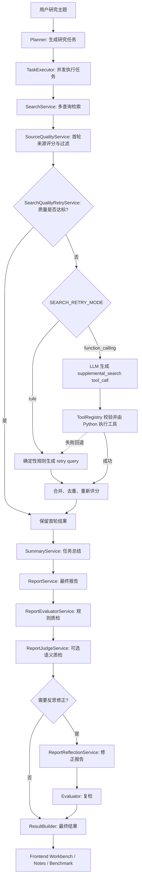

# Deep Research Assistant

一个带证据治理、质量评估和反思闭环的 Deep Research Agent 项目。

它不是简单的“搜索几条资料再让大模型总结”的 RAG Demo，而是把一次研究任务拆成可观测、可评估、可修正的 Agent 工作流：

```text
Planner
  -> TaskExecutor(search -> summary, 多任务并发)
  -> Reporter
  -> Evaluator(规则质检)
  -> LLM Judge(可选语义质检)
  -> Reflection(必要时修正报告并复检)
  -> Result / Notes / Frontend Workbench
```

项目当前定位是：**面向复杂问题研究的工程化 Agent MVP**。它强调任务规划、证据质量、报告可信度、运行可观测性和失败隔离，而不是追求一次性堆很多 Agent 概念。

## 文档导航

- [项目总览与启动说明](README.md)：功能定位、核心能力、目录结构和运行方式。
- [核心代码流程图](core-workflow.md)：按 `DeepResearchAgent.run_stream()` 主线梳理核心方法调用顺序。
- [面试题与参考答案](interview-qa.md)：按项目定位、主流程、并发、报告质检和扩展点整理复习问答。

## 核心亮点

- **多阶段 Agent 工作流**：planner 规划任务，多个任务并发执行，每个任务内部串行完成 `search -> summary`，最后统一生成报告、质检和反思。
- **可插拔搜索质量补检索**：当有效来源不足、高质量来源不足或弱来源比例偏高时，可使用确定性规则或原生 Function Calling 生成补检索请求；工具调用失败时自动回退规则方案。
- **来源质量治理**：对搜索结果做去重、来源类型识别、质量评分、营销页降权、域名多样性控制。
- **证据表与引用一致性**：正文使用 `[T1-S1]` 形式引用来源，参考文献和证据表由程序组装，降低引用漂移。
- **混合报告质检**：规则质检检查引用、证据表和来源指标；LLM Judge 可选补充语义质量判断。
- **报告反思闭环**：如果质检不通过，系统基于质检反馈修正报告一次，并进行最终复检。
- **运行记录可观测**：前端展示研究报告、证据表、运行记录和质检器，可按阶段查看事件流。
- **并发事件流测试**：单测验证多任务并发时的事件顺序、失败隔离和内部控制事件不泄漏。

## 工作流



## 核心能力

### 1. 任务规划

`PlanerService` 会把用户主题拆成 3-5 个互补的研究任务，每个任务包含：

- `title`：任务标题；
- `intent`：研究意图；
- `query`：可直接用于搜索的查询词。

规划完成后，后续任务由 `TaskExecutor` 并发执行。

### 2. 并发任务执行

任务之间并发，单个任务内部串行：

```text
task 1: search -> summary
task 2: search -> summary
task 3: search -> summary
task 4: search -> summary
```

`TaskExecutor` 使用线程池执行任务。worker 线程不直接返回 SSE，而是把事件放入队列，由主线程统一消费，避免流式响应混乱。

关键设计：

- 多任务之间可以交错执行；
- 单个 `task_id` 内部事件顺序保持稳定；
- `EventEmitter.emit()` 用锁包住，避免并发下 `seq` 竞争；
- 单个任务失败不会阻塞其他任务；
- 内部控制事件 `__task_done__` 不会暴露给前端。

### 3. 搜索与补检索

`SearchService` 默认支持轻量多查询：

```text
原始 query
官方 / 学术 query
风险 / 局限 query
```

第一次搜索后，`SourceQualityService` 会先做过滤和评分。如果来源质量不足，
`SearchQualityRetryService` 会触发一次补检索。补检索策略由
`SEARCH_RETRY_MODE` 控制：

触发补检索的典型条件：

- 有效来源数量不足；
- 高质量来源数量不足；
- 弱来源比例过高。

- `rule`（默认）：使用 `DeterministicSearchQueryRewriter` 生成少量确定性 query；
- `function_calling`：把 `supplemental_search` Schema 交给模型，模型只生成
  `tool_calls`；`ToolRegistry` 完成参数校验后，由 Python 调用
  `SupplementalSearchTool.run()`，再复用 `SearchTool.run()` 执行真实搜索。

Function Calling 只替换“补搜什么、如何发起补搜”这一小段，不改变质量门、
结果合并、去重和重新评分逻辑。模型不能控制搜索后端、超时、最大结果数等
运行参数，这些参数由可信的 `SupplementalSearchContext` 注入。工具调用异常、
参数无效或没有返回可用结果时，系统自动回退到 `rule`，避免影响主研究流程。

完整调用链：

```text
SearchQualityRetryService 判断质量不足
  -> FunctionCallingAgent 把 Schema 交给 LLM
  -> LLM 生成 supplemental_search tool_calls
  -> ToolRegistry.execute_function() 校验并执行
  -> SupplementalSearchTool.run()
  -> SearchTool.run()
  -> 合并首轮与补检索结果并重新评分
```

DashScope 的思考模式不支持强制指定某个 `tool_choice`，因此补检索的工具参数
生成请求会局部关闭 thinking；Planner、Summary、Reporter 等复杂推理阶段不受影响。

### 4. 来源质量评分

`SourceQualityService` 负责对搜索结果进行轻量评分：

- academic / official_doc 来源加权；
- company_tech 来源适度加权；
- community / 营销页 / 榜单页降权；
- 摘要过短降权；
- 原始或一手资料加权；
- 查询相关性加权；
- 同一域名集中度控制。

每条来源会保留 `score`、`source_type`、`domain` 和 `reasons`，便于前端证据表和调试排查。

### 5. 任务总结与最终报告

`SummaryService` 基于每个任务的检索上下文生成任务总结。

`ReportService` 再汇总所有已完成任务，生成最终研究报告。报告正文要求使用 `[T1-S1]` 形式引用来源。

参考文献和证据表不让模型自由生成，而是由程序根据正文实际引用自动组装，减少：

- 正文引用不存在；
- 参考文献漏来源；
- 来源编号被模型改写；
- 证据表和正文不一致。

### 6. 混合质检与反思

质检分两层：

```text
ReportEvaluatorService: 规则质检
ReportJudgeService:    可选 LLM 语义质检
```

规则质检关注确定性问题：

- 引用 ID 是否存在；
- 引用准确率；
- 引用召回率；
- weak 来源比例；
- primary 来源比例；
- 域名集中度；
- 硬错误数量。

LLM Judge 关注语义质量：

- 是否回答研究主题；
- 逻辑是否连贯；
- 工程建议是否具体；
- 风险和边界是否充分；
- 是否存在空泛表达或过度断言。

`ReportReflectionService` 根据质检结果决定是否修正报告。如果触发反思，系统只修正一次，然后进行最终复检。这样既有质量闭环，也避免无限多轮反思带来的成本和不稳定。

### 7. 前端工作台

前端位于 `src/frontend`，提供一个面向研究结果检查的工作台：

- 研究报告；
- 证据表；
- 运行记录；
- 质检器；
- 任务列表；
- 报告笔记路径复制；
- 任务笔记路径复制；
- 从任务页跳转到当前任务的运行记录。

前端不是营销页，而是直接展示可用的研究工作台。

## 核心代码导读

建议按下面顺序阅读代码。

### 1. 主流程编排

```text
src/backend/workflow/agent.py
```

重点方法：

- `run_stream()`：完整研究流程；
- `run_plan()`：任务规划；
- `run_report()`：最终报告生成；
- `evaluate()`：规则质检 + 可选 LLM Judge；
- `run_evaluator()`：发出质检事件；
- `run_report_reflection()`：基于质检结果决定是否反思。

核心链路：

```text
planner
  -> task_executor
  -> reporter
  -> evaluator(initial)
  -> reflection
  -> evaluator(final, 如果发生反思)
  -> workflow_done
```

### 2. 并发任务执行

```text
src/backend/workflow/task_executor.py
```

重点方法：

- `execute_tasks_stream()`：创建线程池并消费事件队列；
- `_task_worker()`：worker 执行入口；
- `_execute_single_task_stream()`：单任务串行执行 `search -> summary`；
- `_consume_task_event()`：主线程消费事件；
- `_enqueue_event()`：用锁保证事件构造安全；
- `_handle_task_error()`：单任务失败隔离。

### 3. 搜索链路

```text
src/backend/services/search_service.py
src/backend/services/search_quality_retry_service.py
src/backend/services/source_quality.py
src/backend/search/search_tool.py
src/backend/search/search_*_backend.py
src/backend/llm/function_calling_agent.py
src/backend/tools/supplemental_search_tool.py
src/backend/tools/tool_registry.py
```

重点关注：

- `SearchService.run_search()`；
- `SearchService.run_query_variants()`；
- `SearchService.apply_search_quality_retry()`；
- `SearchQualityRetryService.decide()`；
- `DeterministicSearchQueryRewriter.rewrite()`；
- `FunctionCallingAgent.run()`；
- `ToolRegistry.execute_function()`；
- `SupplementalSearchTool.run()`；
- `SourceQualityService.process_result()`；
- `SourceQualityService.score_item()`。

### 4. 总结、报告、质检与反思

```text
src/backend/services/summary_service.py
src/backend/services/report_service.py
src/backend/services/report_evaluator.py
src/backend/services/report_judge_service.py
src/backend/services/report_reflection_service.py
src/backend/llm/prompts.py
```

建议重点理解：

- summary 是任务级；
- report 是全局汇总；
- evidence table 和 references 是程序组装；
- evaluator 做确定性规则检查；
- judge 做语义质量补充；
- reflection 只修正一次。

### 5. 事件、结果和笔记

```text
src/backend/workflow/research_event_builder.py
src/backend/workflow/research_stage_logger.py
src/backend/workflow/result_builder.py
src/backend/notes/note_service.py
src/backend/notes/notes_index.py
```

这些模块负责：

- SSE 事件协议；
- 运行记录；
- 最终 result 结构；
- 任务笔记；
- 报告笔记；
- notes/index.json。

## 目录结构

```text
deep-research-agent/
├── dev.py
├── requirements.txt
├── docs/
│   ├── README.md
│   ├── core-workflow.md
│   └── interview-qa.md
├── benchmarks/
│   ├── cases.json
│   ├── runner.py
│   └── README.md
├── src/
│   ├── backend/
│   │   ├── api/                 # FastAPI / SSE 入口
│   │   ├── core/                # 配置、日志、安全执行
│   │   ├── domain/              # 数据模型、事件模型
│   │   ├── llm/                 # LLM client、SimpleAgent、Prompts
│   │   ├── notes/               # 任务笔记、报告笔记、索引
│   │   ├── search/              # 搜索工具和后端适配器
│   │   ├── services/            # planner/search/summary/report/evaluator/reflection
│   │   ├── tools/               # 工具注册与 JSON 工具函数
│   │   └── workflow/            # 主编排、事件、结果构建、任务执行器
│   └── frontend/                 # Vue 前端工作台
├── tests/
├── notes/                       # 运行时生成
├── logs/                        # 运行日志
└── storage/
```

> 前端目录当前实际命名为 `frontend`，命令中也使用这个路径。

## 快速开始

### 1. 安装后端依赖

```bash
cd deep-research-agent
python -m venv .venv
source .venv/bin/activate
pip install -r requirements.txt
```

### 2. 安装前端依赖

```bash
cd deep-research-agent/src/frontend
npm install
```

如果 Vite/Rollup 报缺少 `@rollup/rollup-darwin-*`，通常是 npm optional dependency 没装完整，重新执行 `npm install` 即可。

### 3. 配置环境变量

```bash
cd deep-research-agent
cp .env.example .env
```

至少配置：

```env
OPENAI_API_KEY=你的模型 API Key
OPENAI_BASE_URL=https://dashscope.aliyuncs.com/compatible-mode/v1/
CHAT_MODEL=你的对话模型
```

搜索后端可选：

```env
DEFAULT_SEARCH_BACKEND=hybrid
TAVILY_API_KEY=
SERPAPI_API_KEY=
```

### 4. 同时启动前后端

```bash
cd deep-research-agent
.venv/bin/python dev.py
```

默认地址：

```text
Backend:  http://127.0.0.1:8000
Frontend: http://127.0.0.1:5174
```

### 5. 分开启动

后端：

```bash
cd deep-research-agent
.venv/bin/python -m uvicorn backend.api.app:app --app-dir src --host 127.0.0.1 --port 8000 --reload
```

前端：

```bash
cd deep-research-agent/src/frontend
VITE_API_BASE_URL=http://127.0.0.1:8000 npm run dev -- --host 127.0.0.1 --port 5174
```

健康检查：

```bash
curl http://127.0.0.1:8000/health
```

## 常用配置

| 变量 | 默认值 | 说明 |
|---|---:|---|
| `OPENAI_API_KEY` | 空 | 模型 API Key |
| `OPENAI_BASE_URL` | DashScope compatible URL | OpenAI 兼容接口地址 |
| `CHAT_MODEL` | `qwen3.7-max-2026-05-17` | 对话模型 |
| `EMBEDDING_MODEL` | `text-embedding-v4` | Embedding 模型，当前主流程使用较少 |
| `LLM_INPUT_PRICE_PER_MILLION` | `0` | 每 100 万输入 Token 的单价；为 0 时不估算成本 |
| `LLM_OUTPUT_PRICE_PER_MILLION` | `0` | 每 100 万输出 Token 的单价；为 0 时不估算成本 |
| `LLM_PRICE_CURRENCY` | `CNY` | Benchmark 成本展示币种 |
| `DEFAULT_SEARCH_BACKEND` | `hybrid` | 搜索后端，支持 `hybrid` / `duckduckgo` / `tavily` / `serpapi` |
| `SEARCH_MAX_RESULTS` | `5` | 每个任务最终保留来源数量 |
| `ENABLE_MULTI_QUERY_SEARCH` | `true` | 是否开启多查询检索 |
| `SEARCH_QUERY_VARIANT_COUNT` | `3` | 每个任务最多使用几个 query |
| `ENABLE_SEARCH_QUALITY_RETRY` | `true` | 来源质量不足时是否触发一次补检索 |
| `SEARCH_RETRY_MODE` | `rule` | 补检索实现：`rule` 或 `function_calling`；Function Calling 失败会回退规则版 |
| `FUNCTION_CALLING_MAX_STEPS` | `2` | 补检索工具调用循环的最大步数 |
| `FETCH_FULL_PAGE` | `true` | Tavily 下是否尝试获取全文 |
| `MAX_TOKENS_PER_SOURCE` | `1000` | 单来源进入总结上下文的长度限制 |
| `TASK_MAX_WORKERS` | `4` | 子任务并发数 |
| `NOTES_ENABLED` | `true` | 是否写入任务/报告笔记 |
| `NOTES_WORKSPACE` | `./notes` | Notes 输出目录 |
| `ENABLE_LLM_JUDGE` | `false` | 是否开启 LLM 语义质检 |

## API

后端主要接口：

```text
GET /health
GET /healthz
GET /api/backends
GET /api/research/stream?topic=...&backend=...
```

`/api/research/stream` 返回 SSE 事件，前端和 benchmark 都走这条真实链路。

## 测试

后端全量测试：

```bash
cd deep-research-agent
.venv/bin/python -m unittest discover -s tests -p 'test_*.py'
```

重点测试：

```bash
.venv/bin/python -m unittest discover -s tests -p 'test_task_executor_event_stream.py'
.venv/bin/python -m unittest discover -s tests -p 'test_search_service.py'
.venv/bin/python -m unittest discover -s tests -p 'test_report_evaluator.py'
```

前端构建：

```bash
cd deep-research-agent/src/frontend
npm run build
```

## Benchmark

Benchmark 位于 `benchmarks/`，通过真实 SSE 接口运行固定问题集。

先启动后端，然后执行：

```bash
cd deep-research-agent
.venv/bin/python benchmarks/runner.py --backend duckduckgo
```

只跑单个 case：

```bash
.venv/bin/python benchmarks/runner.py --case rag_hallucination --backend duckduckgo
```

第一版工程评测在不修改业务流程的前提下补充了：

- 复用 `run_id` 的任务级 Trace 完整性检查；
- 从 SSE 事件时间戳推导 Planner、Search、Summary、Report 等阶段耗时；
- 总耗时和阶段耗时的 P50/P95/P99；
- 从模型原生 `usage` 汇总 Planner、Summary、Reporter、Reflection 和补检索 Token；
- 从现有 SSE 汇总 Tool Call 参数正确率、补检索成功率和规则回退率；
- 基于 Fake LLM/Search 的离线 Agent 固定评测集；
- 独立 Locust SSE 并发压测；
- GitHub Actions 离线回归门禁，以及手动触发的真实六题 Benchmark。

离线 Agent 评测：

```bash
.venv/bin/python benchmarks/agent_eval.py
```

回归阈值检查：

```bash
.venv/bin/python benchmarks/regression_gate.py \
  benchmarks/runs/<run_id>/metrics.json
```

并发压测参见 `load_tests/README.md`。运行时只增加 usage 与工具结果观测字段，
不改变 Planner、Research、Report、Evaluate、Reflect 或 Function Calling
的业务决策、调用顺序和失败回退逻辑。

Benchmark 会保存：

- 原始 SSE 事件；
- 最终 result；
- 最终报告；
- 基础质量指标；
- 精确 Token、可选估算成本和分阶段 Usage；
- 补检索 Tool Call、参数校验、执行成功与规则回退指标；
- Markdown 回归报告。

## 和普通 RAG Demo 的区别

| 维度 | 普通 RAG Demo | 当前项目 |
|---|---|---|
| 查询方式 | 单次 query 检索 | planner 拆任务 + 多查询检索 |
| 搜索质量 | 被动接受结果 | 来源评分 + 可插拔规则/Function Calling 补检索 |
| 执行方式 | 单链路串行 | 多任务并发，任务内部串行 |
| 来源处理 | 简单拼接 | 去重、评分、域名多样性控制 |
| 报告引用 | 模型自由生成 | 来源 ID + 程序组装参考文献/证据表 |
| 质量检查 | 人工看结果 | 规则质检 + 可选 LLM Judge |
| 自我修正 | 无 | 质检驱动的一次报告反思修正 |
| 可观测性 | 控制台输出 | SSE 事件、运行记录、笔记、质检器 |
| 稳定性验证 | 少量手测 | 单测覆盖并发事件流和失败隔离 |

## 当前边界

已经实现：

- planner 任务规划；
- 多任务并发执行；
- 多查询搜索；
- 可插拔搜索质量补检索（规则版默认，Function Calling 可选并带失败回退）；
- 来源质量评分；
- 任务总结；
- 最终报告；
- 证据表和参考文献组装；
- 规则质检；
- 可选 LLM Judge；
- 报告反思修正和复检；
- 前端报告/证据表/运行记录/质检器；
- notes 笔记输出；
- benchmark runner；
- 并发事件流稳定性测试。

暂时不做：

- 真正长期记忆或向量库；
- 多轮无限 self-reflection；
- 完整 LLM-as-a-Judge 评测平台；
- 生产级权限、队列、任务持久化和监控告警；
- 规则平台或动态规则引擎。

这些能力适合作为后续演进方向。当前版本优先保证 Deep Research Agent 主链路稳定、可解释、可展示。

## 面试讲法

可以用一句话概括：

```text
这是一个带证据治理和质量闭环的 Deep Research Agent。
它不只是调用搜索再让模型总结，而是从任务规划、证据检索、来源过滤、报告生成、质量评估到反思修正形成闭环，并且前端能展示证据表、质检器和运行记录。
```

重点展开：

1. **Agent 编排**：planner、search、summary、reporter、evaluator、reflection 的职责拆分。
2. **证据治理**：来源 ID、证据表、引用准确率、召回率、来源质量指标。
3. **搜索自我补救**：来源质量不足时通过规则或 Function Calling 自动补检索，模型只生成工具请求，Python 后端校验并执行真实搜索。
4. **混合质检**：规则负责确定性检查，LLM Judge 负责语义质量判断。
5. **反思闭环**：质检不通过时修正报告一次并复检，控制质量和成本。
6. **并发稳定性**：多任务并发、事件队列、emit lock、失败隔离。

## 提交建议

不要提交运行时私有产物：

```text
.env
.venv/
logs/
notes/
storage/
benchmarks/runs/
benchmarks/reports/
src/frontend/node_modules/
```

如果需要展示样例，建议单独整理到 `examples/`，不要直接提交真实运行目录。
