# Deep Research Assistant 核心流程图

这份文档只梳理主流程，不要求背代码细节。阅读目标是能顺着
`DeepResearchAgent.run_stream()` 讲清楚一次研究任务如何从 topic 变成最终报告。

## 主流程

```mermaid
flowchart TD
    A["DeepResearchAgent.run_stream(topic, backend)"] --> B["创建 run context"]
    B --> B1["EventEmitter / ResearchState / EventBuilder / TaskExecutor"]
    B1 --> C["yield workflow_started"]

    C --> D["run_plan(ctx)"]
    D --> E["PlanerService.run_plan(state)"]
    E --> F["parse_plan(plan)"]
    F --> G["state.tasks = TodoItem[]"]
    G --> H["yield planner_done"]

    H --> I["TaskExecutor.execute_tasks_stream(state, emitter)"]
    I --> J["线程池并发执行多个 TodoItem"]
    J --> K["_execute_single_task_stream(task)"]

    K --> L["SearchService.run_search(task)"]
    L --> L1["build_query_variants(query)"]
    L1 --> L2["run_query_variants(...)"]
    L2 --> L3["SourceQuality: 首轮过滤与评分"]
    L3 --> L3A{"SearchQualityRetry: 是否需要补检索?"}
    L3A -- "否" --> L4["attach_source_ids(task_id, result)"]
    L3A -- "是" --> L3B{"SEARCH_RETRY_MODE"}
    L3B -- "rule" --> L3C["规则生成 retry query"]
    L3B -- "function_calling" --> L3D["FunctionCallingAgent 生成 tool_calls"]
    L3D --> L3E["ToolRegistry 参数校验与执行"]
    L3E -- "成功" --> L3F["SupplementalSearchTool → SearchTool"]
    L3E -. "异常/无结果回退" .-> L3C
    L3C --> L3G["合并、去重、重新评分"]
    L3F --> L3G
    L3G --> L4
    L4 --> M["task.search_results / source_summary / notices"]
    M --> N["yield task_sources_done"]

    N --> O["SummaryService.stream_summary(search_result)"]
    O --> P["LLM 流式生成任务总结"]
    P --> Q["yield llm_delta(summary)"]
    Q --> R["task.summary = get_summary()"]
    R --> S["yield task_status completed / task_summary_done / task_done"]

    S --> T{"所有任务完成?"}
    T -- "否" --> J
    T -- "是" --> U["run_report(ctx)"]

    U --> V["ReportService.stream_report(topic, completed_tasks)"]
    V --> W["LLM 流式生成报告正文"]
    W --> X["yield llm_delta(reporter)"]
    X --> Y["ReportService.assemble_report(raw_report, tasks)"]
    Y --> Y1["提取正文引用 Tn-Sn"]
    Y1 --> Y2["程序生成参考文献"]
    Y2 --> Y3["程序生成证据表"]
    Y3 --> Z["state.report = final_report"]
    Z --> AA["yield report_done"]

    AA --> AB["run_evaluator(ctx, initial)"]
    AB --> AC["evaluate(report, errors, topic, tasks)"]
    AC --> AD["ReportEvaluatorService.run(report)"]
    AD --> AE{"ENABLE_LLM_JUDGE?"}
    AE -- "否" --> AH["state.evaluator = rule evaluator"]
    AE -- "是" --> AF["ReportJudgeService.run(...)"]
    AF --> AG["hybrid_score = rule 60% + judge 40%"]
    AG --> AH
    AH --> AI["yield evaluator_done(initial)"]

    AI --> AJ["run_report_reflection(ctx, evaluator)"]
    AJ --> AK["ReportReflectionService.decide(evaluator)"]
    AK --> AL{"需要修正报告?"}
    AL -- "否" --> AM["yield reflection_skipped"]
    AL -- "是" --> AN["ReportReflectionService.revise_report(...)"]
    AN --> AO["ReportService.assemble_report(revised_report, tasks)"]
    AO --> AP["state.report = revised_report"]
    AP --> AQ["run_evaluator(ctx, final)"]
    AQ --> AR["yield evaluator_done(final)"]
    AR --> AS["yield reflection_done"]

    AM --> AT["创建报告笔记"]
    AS --> AT
    AT --> AU["yield workflow_done"]
```



## 推荐阅读顺序

### 1. 总入口

- `DeepResearchAgent.run_stream()`
- `_create_run_context()`

先看一次完整研究的阶段顺序，以及每个阶段在哪里 `yield` 事件。

### 2. 规划阶段

- `DeepResearchAgent.run_plan()`
- `PlanerService.run_plan()`
- `PlanerService.parse_plan()`

看 topic 如何变成 `TodoItem[]`，也就是后续并发任务的输入。

### 3. 任务执行阶段

- `TaskExecutor.execute_tasks_stream()`
- `TaskExecutor._task_worker()`
- `TaskExecutor._execute_single_task_stream()`
- `TaskExecutor._consume_task_event()`
- `TaskExecutor._enqueue_event()`

重点理解两件事：

- 多个任务之间并发执行；
- 单个任务内部固定按 `search -> summary` 串行执行。

### 4. 搜索阶段

- `SearchService.run_search()`
- `SearchService.build_query_variants()`
- `SearchService.run_query_variants()`
- `SearchService.apply_search_quality_retry()`
- `FunctionCallingAgent.run()`
- `ToolRegistry.execute_function()`
- `SupplementalSearchTool.run()`
- `SearchService.attach_source_ids()`
- `SearchService.build_sources_summary()`
- `SearchService.build_research_context()`

第一遍只需要知道搜索阶段最终产出两份东西：

- `task.search_results`：结构化来源，给报告引用和证据表用；
- `search_results_text`：长上下文，给 `SummaryService` 用。

`SourceQualityService` 和 `SearchQualityRetryService` 是搜索结果治理，第一遍可以
后置。需要理解 Function Calling 时，再顺着下面的调用链阅读：

```text
SearchService.apply_search_quality_retry()
  -> FunctionCallingAgent.run()
  -> ToolRegistry.execute_function()
  -> SupplementalSearchTool.run()
  -> SearchTool.run()
```

这里 LLM 只生成 `tool_calls`，不会真正执行搜索；Python 后端负责 Schema 校验、
工具执行和失败回退。默认 `SEARCH_RETRY_MODE=rule`，因此不开启配置时原流程不变。

### 5. 总结阶段

- `SummaryService.stream_summary()`
- `SummaryService.build_summary_prompt()`

看搜索上下文如何被包装成 prompt，并流式写回 `task.summary`。

### 6. 报告阶段

- `ReportService.stream_report()`
- `ReportService.build_report_prompt()`
- `ReportService.assemble_report()`
- `ReportService.extract_used_source_ids()`
- `ReportService.build_references()`
- `ReportService.build_evidence_table()`

这是必须看的核心。设计要点是：LLM 只写报告正文，参考文献和证据表由程序根据
`Tn-Sn` 引用重新组装，减少引用漂移。

### 7. 质检阶段

- `DeepResearchAgent.run_evaluator()`
- `DeepResearchAgent.evaluate()`
- `ReportEvaluatorService.run()`
- `ReportJudgeService.run()`

第一遍可以不细看 `ReportEvaluatorService` 的所有规则，但要知道
`state.evaluator` 会包含评分、warnings、引用准确率、引用召回率、弱来源比例等指标。

`ReportJudgeService.run()` 只有开启 `ENABLE_LLM_JUDGE` 时才会执行，它负责语义质检。

### 8. 反思修正阶段

- `ReportReflectionService.decide()`
- `ReportReflectionService.revise_report()`
- `ReportReflectionService.build_revision_prompt()`

看 evaluator 结果如何决定是否修报告。当前策略是最多修正一次，然后可选做 final evaluator。

### 9. API / SSE 包装

- `stream_research()`
- `ResearchSseStreamer.stream()`
- `ResearchSseStreamer._produce_agent_events()`
- `ResearchSseStreamer._workflow_timeout_sse()`

最后再看 API 更顺：内部主流程已经理解后，再看它如何被包装成浏览器 EventSource 可以消费的 SSE。

## 一句话心智模型

`run_stream()` 负责阶段编排，`ResearchState` 负责保存运行状态，
`TaskExecutor` 负责并发任务，`Search/Summary/Report/Evaluator/Reflection`
各自负责一个业务阶段，`EventBuilder/SSE` 负责把阶段进展稳定推给外部。
