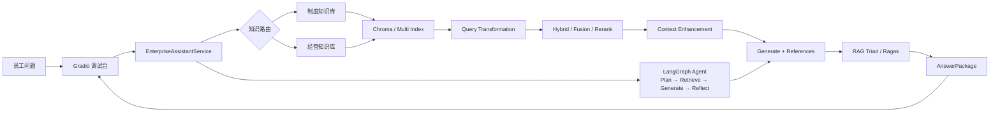

# Enterprise RAG Assistant

一套面向企业制度与经营资料的 Agentic RAG 员工助手。系统以统一问答服务编排知识路由、高级检索、答案生成、引用治理和质量评估，并提供 LangChain、LlamaIndex 与 LangGraph 三类实现作为策略对照。

项目的重点不是堆叠检索算法，而是建立一套**可组合、可观测、可评估**的 RAG 工程底座：相同问题可以切换不同检索策略，所有策略最终收敛为统一结果模型，从而支持效果对比与问题归因。

## 系统架构



## 统一服务与知识路由

`EnterpriseAssistantService` 隔离 UI、业务知识和底层框架，负责根据问题选择制度库、经营库或跨库检索，并将不同实现统一封装为 `AnswerPackage`：

- `answer`：最终回答；
- `context`：实际输入模型的上下文；
- `references`：命中文档与引用来源；
- `route` / `strategy`：知识路由与实际策略；
- `debug_note`：规划、召回、反思和降级轨迹；
- `triad_report`：可选的在线质量诊断结果。

因此，LangChain、LlamaIndex 和 LangGraph 可以共享同一套生成、引用、调试与评估接口，避免策略实验侵入上层业务。

## 高级 RAG 检索策略

项目在 `RetrievalStrategy` 中统一注册 29 个策略枚举，并将检索增强分为查询构造、候选召回、上下文重构、答案自校验和 Agent 编排五个层次。

### 1. 基础召回与结果融合

| 策略 | 核心思想 | 适用场景 |
| --- | --- | --- |
| `plain` | 直接使用原问题进行向量召回，作为所有增强策略的 baseline | 验证向量检索基础效果、建立对照组 |
| `hybrid` | 融合 BM25 关键词检索与向量语义检索，通过权重兼顾精确词项和语义近似 | 制度名称、系统缩写、金额等关键词与口语表达并存 |
| Rerank 控制项 | 先扩大候选集，再由 LLM 逐条或批量重排，只保留最相关的 Top N | 初召回覆盖较好但排序不稳定、上下文预算有限 |

Hybrid Search 的价值在于弥补单一路径偏差：BM25 擅长命中“VPN、OA、税号”等精确词，向量检索擅长识别“电脑坏了”和“设备故障”等语义等价表达。

### 2. Query Transformation

| 策略 | 核心思想 | 适用场景 |
| --- | --- | --- |
| `query2doc` | 让 LLM 将短问题扩写成接近企业文档表达的伪文档，再用原问题与伪文档联合检索 | 用户问题过短、关键词不足或表达口语化 |
| `hyde` | 先生成假设答案，将假设文档与原问题向量融合后检索，让查询向量靠近可能的答案空间 | 问题与正式制度文本存在较大表达鸿沟 |
| `rewrite` | 保留原意，将问题改写为结构更明确、关键词更完整的检索表达 | 指代不清、口语化或包含冗余上下文 |
| `step_back` | 从具体问题抽象出更高层原则问题，先检索背景规则，再支撑具体回答 | 具体案例需要通用制度、政策原则作为依据 |
| `sub_question` | 将复合问题拆成多个独立子问题分别检索，再去重合并证据 | 一个请求同时询问流程、材料、时效和审批人 |

这组策略的共同出发点是：**用户输入不一定是最优检索 Query**。先改变查询表达，再执行召回，通常比盲目增加 `top_k` 更有效。

### 3. 多索引与结构化召回

| 策略 | 核心思想 | 适用场景 |
| --- | --- | --- |
| `parent_child` | 用细粒度子块提升匹配精度，命中后返回信息更完整的父文档 | 小块容易命中，但回答需要完整条款上下文 |
| `summary_index` | 为原始文档建立摘要与关键词索引，命中摘要后映射回原文 | 概览、原则、制度总体要求等总结型问题 |
| `hypothetical_question` | 为文档预生成用户可能提出的问题，以“问题对问题”提升口语查询匹配率 | 制度原文正式，但用户表达高度口语化 |
| `multi_index` | 并行查询父子块、摘要和假设问题索引，再对结果去重融合 | 问题类型不稳定，需要多种索引表达互补 |

多索引的关键不是重复存储文档，而是为同一份知识建立多种“可被检索的视图”，让系统可以按问题形态匹配最合适的知识表示。

### 4. 上下文增强

| 策略 | 核心思想 | 适用场景 |
| --- | --- | --- |
| `sentence_window` | 以句子作为精确检索单元，返回时扩展命中句的前后窗口 | 单句命中准确，但缺少前提、例外或后续说明 |
| `auto_merging` | 从细粒度子块开始召回，当同一父节点命中达到阈值时自动合并为更高层文档 | 多个相邻片段共同构成完整答案、固定窗口不够灵活 |

这两种策略把“用于匹配的粒度”和“交给模型的粒度”解耦：检索阶段保持精确，生成阶段恢复足够上下文。

### 5. 迭代检索与 Self-RAG

| 策略 | 核心思想 | 适用场景 |
| --- | --- | --- |
| `iterative` | 第一轮检索后根据已有上下文生成补充查询，再执行第二轮检索 | 首轮证据暴露了新的实体、条件或信息缺口 |
| `self_rag` | 对候选文档相关性、答案忠实度和答案有效性逐级判断；不足时 Query2Doc、Rewrite 或安全兜底 | 对幻觉敏感、宁可拒答也不能编造制度 |
| `self_rag_langgraph` | 将 Self-RAG 的检索、评分、改写、生成和校验建模为显式 LangGraph 状态图 | 需要观察节点状态、调试分支并扩展恢复逻辑 |

Self-RAG 将固定的 `retrieve → generate` 升级为带判断分支的 `retrieve → grade → generate → verify → rewrite/fallback`，使“上下文不足”成为可处理状态，而不是直接交给模型猜测。

### 6. LlamaIndex 对照实现

LlamaIndex 策略复用同一套 Qwen 与 DashScope Embedding 客户端，以框架原生 Index、Retriever、Query Transform 和 Postprocessor 实现高级检索，用于对照手写策略与成熟框架封装。

| 策略 | 核心思想 | 适用场景 |
| --- | --- | --- |
| `llama_plain` | 基于 `VectorStoreIndex` 的基础向量召回 | LlamaIndex baseline |
| `llama_sentence_window` | `SentenceWindowNodeParser` 精确命中句子，`MetadataReplacementPostProcessor` 恢复窗口 | 需要句级召回和上下文扩展 |
| `llama_auto_merging` | 分层切块后由 `AutoMergingRetriever` 按命中密度回并父节点 | 长文档的层级化上下文恢复 |
| `llama_hyde` | 使用 `HyDEQueryTransform` 生成假设文档增强查询表示 | 查询与文档语义空间差距较大 |
| `llama_query_fusion` | 生成多个改写查询并行召回，通过 RRF 融合不同结果排名 | 单一 Query 容易遗漏召回、需要提升覆盖率 |
| `llama_hybrid` | 融合 BM25 与 Vector Retriever | 精确关键词与语义召回互补 |
| `llama_rerank` | 扩大初召回后使用 `LLMRerank` 对节点二次排序 | 候选较多但上下文窗口有限 |
| `llama_router` | 通过 Router 在多个检索工具间选择 | 不同问题应进入不同索引或检索器 |
| `llama_recursive` | 先命中入口节点，再递归进入关联子索引 | 文档或知识具有明显层级与引用关系 |
| `llama_summary` | 通过 `SummaryIndex` 聚合文档后回答概览问题 | 总结、归纳和全局性问题 |
| `llama_auto_retrieval` | 根据问题自动生成 metadata filter，再结合语义检索 | 文档具有部门、类型、时间等结构化元数据 |
| `llama_graph` | 使用 PropertyGraph / KnowledgeGraph 风格索引连接实体关系 | 问题依赖跨文档实体关系与多跳关联 |

### 7. LangGraph Agentic RAG

`langgraph_agent` 不再只是选择一种 Retriever，而是将企业问答建模为可观测状态图：

```text
plan
  → retrieve_rules / retrieve_business / retrieve_both
  → generate
  → reflect
  → revise / end
```

- `plan` 判断制度、经营或跨库路由，并生成最多两个检索 Query。
- `retrieve_*` 执行知识库工具，统一去重和上下文组装。
- `generate` 严格依据检索证据回答，并输出引用。
- `reflect` 判断答案是否被上下文支持、是否覆盖用户问题。
- `revise` 根据 critique 定向修订，敏感或证据不足场景可标记人工复核。

## 策略选择建议

| 问题特征 | 推荐策略 |
| --- | --- |
| 建立最小对照组 | `plain` / `llama_plain` |
| 制度关键词和口语语义并存 | `hybrid` / `llama_hybrid` |
| 问题过短或表达口语化 | `rewrite`、`query2doc`、`hyde` |
| 一个问题包含多个诉求 | `sub_question` |
| 需要先理解上位原则 | `step_back` |
| 小块命中但上下文不完整 | `parent_child`、`sentence_window`、`auto_merging` |
| 单次查询召回覆盖不足 | `llama_query_fusion` |
| 对幻觉和证据一致性敏感 | `self_rag` / `self_rag_langgraph` |
| 需要完整的规划与反思闭环 | `langgraph_agent` |

## 质量评估与可观测性

- **RAG Triad 在线诊断**：对单次问答评估 Context Relevance、Groundedness 和 Answer Relevance，帮助判断问题发生在召回、上下文还是生成阶段。
- **Ragas 离线评估**：使用固定问题集批量比较 Context Precision、Context Recall、Faithfulness 与 Answer Relevancy，适合策略选型和回归验证。
- **调试轨迹**：Gradio 页面展示 route、strategy、context、references 和 LangGraph debug steps，保证每次回答都能回溯实际链路。

## 快速启动

```bash
python3.10 -m venv .venv
.venv/bin/pip install -r requirements.txt
cp ../.env.example ../.env
.venv/bin/python app.py
```

访问 `http://127.0.0.1:7860`。首次运行会根据 `data/` 中的示例知识文档构建本地 Chroma 索引。

只预览界面、不调用模型或构建索引：

```bash
.venv/bin/python preview.py
```

## 测试与评估

```bash
# 自动化测试
.venv/bin/python -m pytest -q

# 对比 Hybrid 与 LangGraph Agent 等策略
.venv/bin/python run_eval.py
```

## 目录结构

```text
data/                       # 企业制度与经营示例知识
src/
├── rag_service.py          # 统一问答服务、路由与策略分发
├── rag_types.py            # 策略枚举、参数与统一结果模型
├── retrieval_enhance.py    # 原生高级检索策略
├── multi_index_retriever.py# 父子块、摘要与假设问题索引
├── advanced_retrieval.py   # Sentence Window 与 Auto Merging
├── self_rag_retriever.py   # Self-RAG 线性版与 LangGraph 版
├── llamaindex_retrieval_enhance.py # LlamaIndex 对照实现
├── langgraph_enterprise_agent.py   # Agentic RAG 状态图
└── evaluator.py            # Ragas 离线评估
tests/                      # 自动化测试
```

## 深入文档

- [总体架构](docs/architecture.md)
- [LangGraph Agent](docs/langgraph-agent.md)
- [RAG 检索策略与代码入口](docs/rag-strategies.md)
- [评估与调试](docs/evaluation-and-debugging.md)
- [核心流程](docs/flows.md)
- [类关系图](docs/class-diagrams.md)
