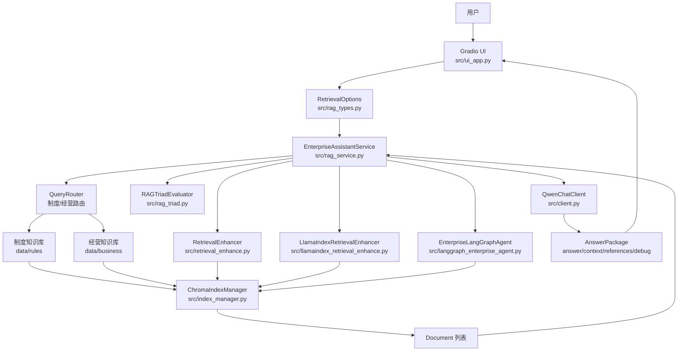

# 架构文档

`enterprise_employee_assistant` 是一个企业知识库问答项目。它把企业制度文档、经营资料、检索增强策略、RAG 评估和 LangGraph Agent 编排放在同一个可运行的 Gradio 应用里。

## 总体分层



## 目录职责

| 路径 | 职责 |
| --- | --- |
| `app.py` | 应用入口，加载配置，初始化 LLM、Embedding、索引、检索增强器、Agent、评估器和 UI |
| `src/config.py` | 项目路径、模型名、API Key、Chroma 存储目录 |
| `src/client.py` | Qwen chat completion 客户端和 DashScope embedding 客户端 |
| `src/data_loader.py` | 读取 `data/rules` 和 `data/business`，切分为 LangChain `Document` |
| `src/index_manager.py` | 管理 Chroma 两个集合：制度库和经营库 |
| `src/rag_types.py` | `RetrievalStrategy`、`RetrievalOptions`、`AnswerPackage` |
| `src/rag_service.py` | 主编排层：路由、选择策略、生成回答、整理引用、触发评估 |
| `src/retrieval_enhance.py` | LangChain/手写版 RAG 策略入口 |
| `src/multi_index_retriever.py` | parent-child、summary、hypothetical question、multi-index |
| `src/advanced_retrieval.py` | sentence-window、auto-merging |
| `src/self_rag_retriever.py` | Self-RAG 线性版和 LangGraph 版 |
| `src/llamaindex_retrieval_enhance.py` | LlamaIndex 版检索策略 |
| `src/langgraph_enterprise_agent.py` | Agentic RAG：plan、retrieve、generate、reflect、revise |
| `src/rag_triad.py` | LLM-as-a-judge 版 RAG Triad 评估 |
| `src/evaluator.py` | Ragas 离线评估入口 |
| `src/ui_app.py` | Gradio 页面和参数控件 |

## 数据层

项目有两个知识库：

| 知识库 | 数据目录 | Chroma collection | 检索方法 |
| --- | --- | --- | --- |
| 企业制度 | `data/rules` | `employee_rules` | `ChromaIndexManager._search_rules()` |
| 经营资料 | `data/business` | `business_insights` | `ChromaIndexManager._search_business()` |

启动时 `app.py` 调用：

```text
Config -> DataLoader -> ChromaIndexManager._ensure_indexes()
```

`_ensure_indexes()` 会读取 `storage/manifest.json` 中的文档签名。如果文档变化，才重建 Chroma collection。

## 服务层

`EnterpriseAssistantService` 是项目的中枢。它的职责是：

1. 接收 UI 传来的 `RetrievalOptions`。
2. 判断是否走 `langgraph_agent` 特殊入口。
3. 对普通问题使用 `QueryRouter` 区分制度/经营。
4. 对制度问题按 `RetrievalStrategy` 选择检索增强策略。
5. 将检索到的 `docs` 转成上下文。
6. 调用 Qwen 生成答案。
7. 统一返回 `AnswerPackage`。
8. 如果 UI 开启 `enable_triad_eval`，额外执行 RAG Triad 评估。

核心代码：

- `src/rag_service.py`
- `EnterpriseAssistantService.answer()`
- `EnterpriseAssistantService._retrieval_rules()`
- `EnterpriseAssistantService._langgraph_agent_answer()`

## UI 层

UI 有三个检索实现选项：

| UI 实现 | 对应策略 |
| --- | --- |
| `langchain` | 手写/LangChain 风格策略，如 `hybrid`、`hyde`、`self_rag` |
| `llamaindex` | LlamaIndex 策略，如 `llama_hybrid`、`llama_recursive` |
| `langgraph` | `langgraph_agent` |

核心代码：

- `src/ui_app.py`
- `build_gradio_app()`
- `_strategy_choices()`
- `_chat()`

## 返回对象

前端展示不直接依赖底层检索器返回值，而是依赖统一结构：

```python
AnswerPackage(
    answer="最终答案",
    context="命中的上下文",
    references=["leave_policy.txt"],
    route="rule",
    strategy=RetrievalStrategy.HYBRID,
    debug_note="调试信息",
    triad_report="可选评估报告",
)
```

这个对象定义在 `src/rag_types.py`。

## 设计取舍

- 将检索策略放在 service 之后，而不是 UI 直接调用策略，方便统一评估、引用和错误处理。
- 将 LlamaIndex 策略包装成 `RetrievalResult`，让它和手写策略共用生成和展示逻辑。
- 将 LangGraph Agent 做成独立入口，因为它自己包含计划、检索、生成、反思，不应该再被普通 service router 二次拆分。
- RAG Triad 默认关闭，因为它会额外调用模型，更适合调试、对比和复盘。
