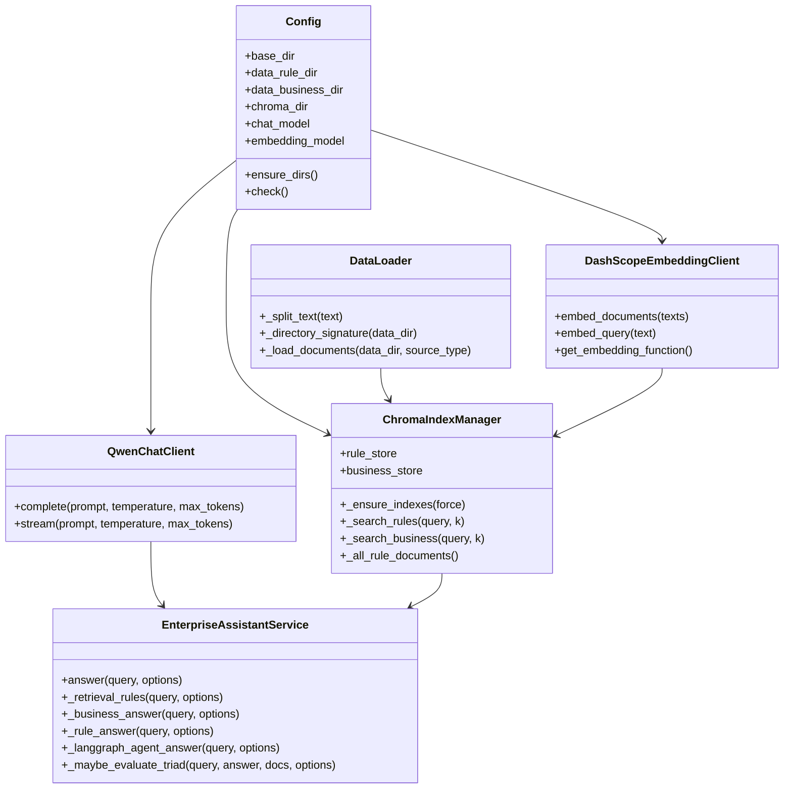
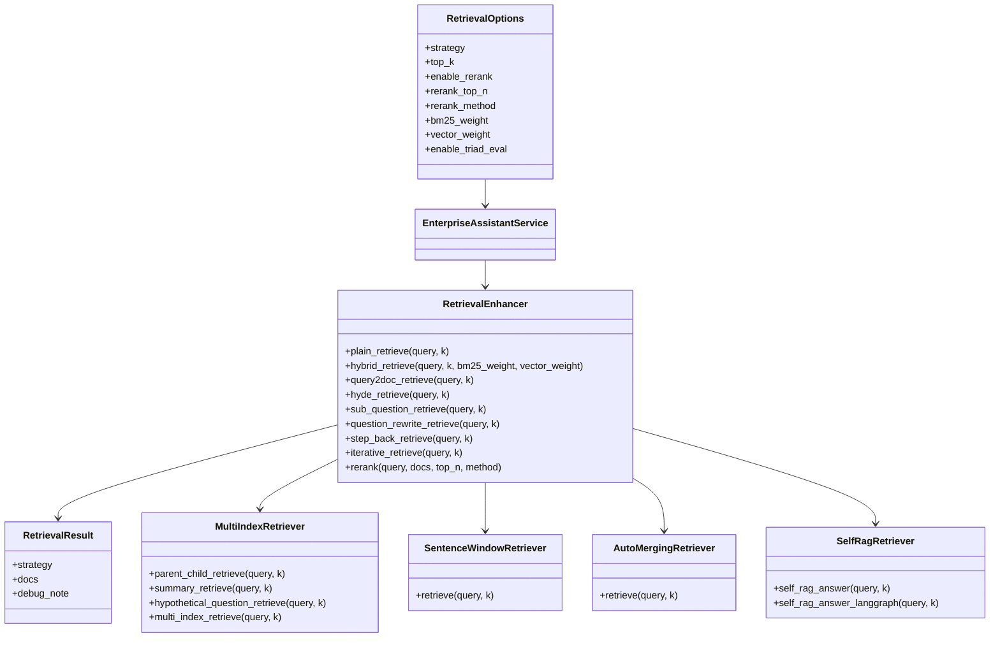
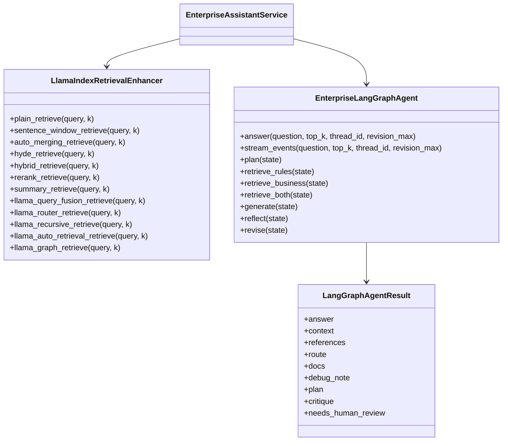
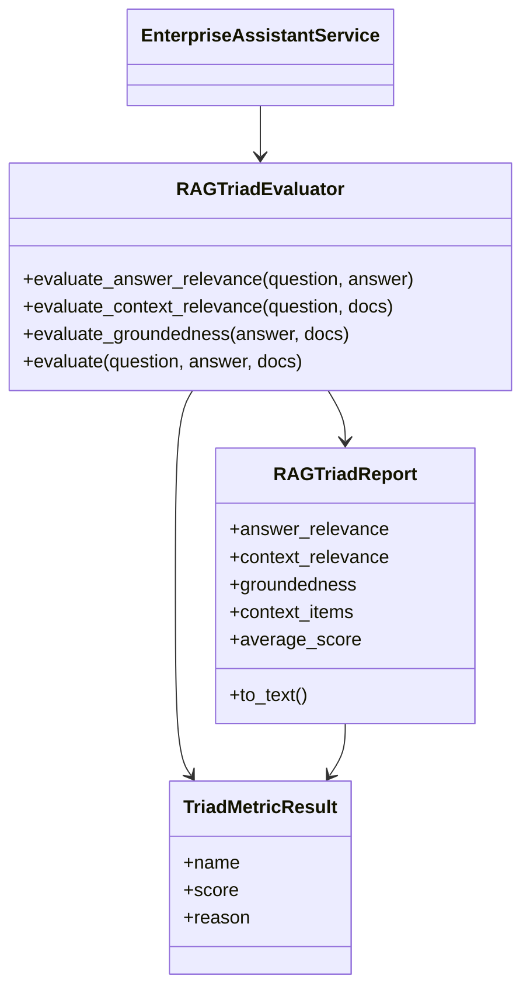

# 类图

本页展示核心类之间的协作关系。类图只保留关键字段和方法，便于理解项目结构。

## 主服务类图

代码位置：

- `src/config.py`
- `src/client.py`
- `src/data_loader.py`
- `src/index_manager.py`
- `src/rag_service.py`

## 检索增强类图

代码位置：

- `src/rag_types.py`
- `src/retrieval_types.py`
- `src/retrieval_enhance.py`
- `src/multi_index_retriever.py`
- `src/advanced_retrieval.py`
- `src/self_rag_retriever.py`

## LlamaIndex 与 LangGraph 类图

代码位置：

- `src/llamaindex_retrieval_enhance.py`
- `src/langgraph_enterprise_agent.py`
- `src/rag_service.py`

## 评估类图

代码位置：

- `src/rag_triad.py`
- `src/advanced_rag_types.py`
- `src/evaluator.py`
