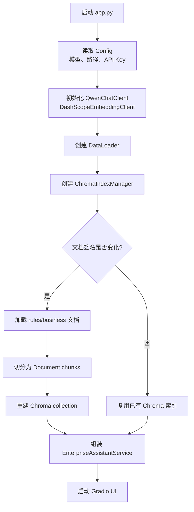
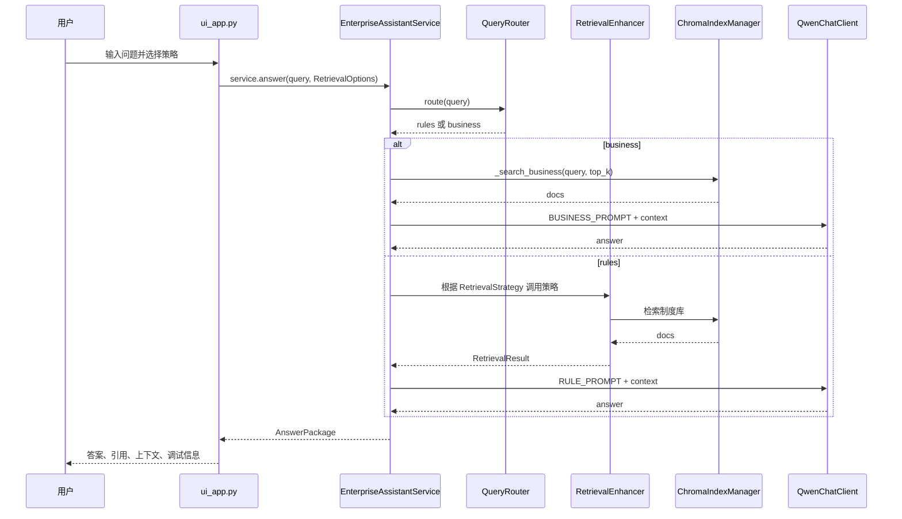
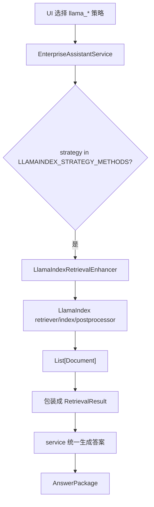
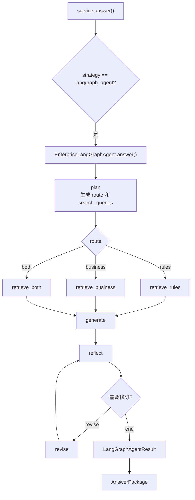
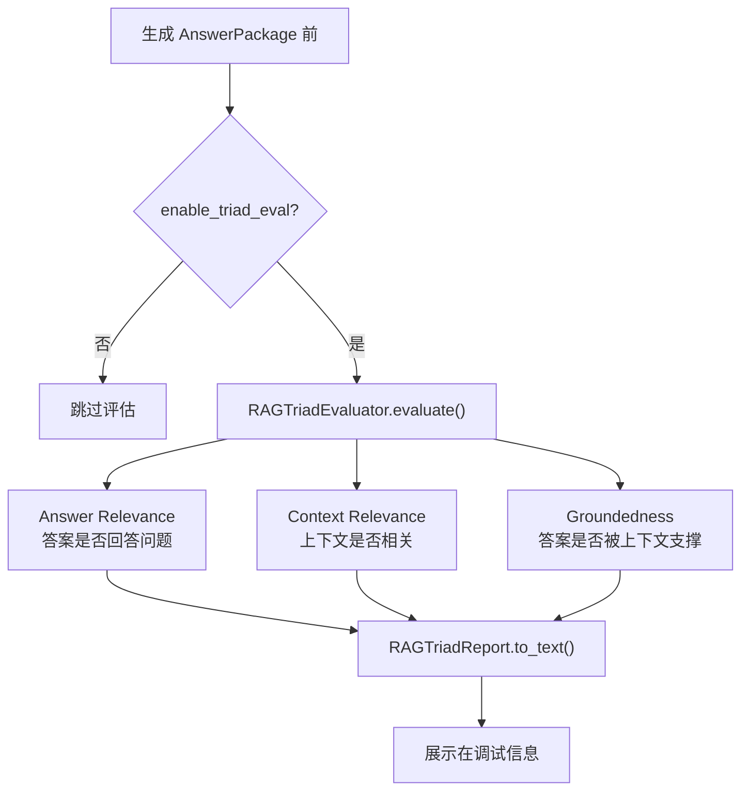

# 流程图

本页用流程图描述项目的关键执行路径。

## 启动与索引构建

代码位置：

- `app.py::build_service()`
- `src/config.py::Config`
- `src/data_loader.py::DataLoader`
- `src/index_manager.py::ChromaIndexManager._ensure_indexes()`

## 普通 RAG 问答流程

代码位置：

- `src/ui_app.py::_chat()`
- `src/rag_service.py::EnterpriseAssistantService.answer()`
- `src/rag_service.py::EnterpriseAssistantService._retrieval_rules()`
- `src/retrieval_enhance.py::RetrievalEnhancer`

## LlamaIndex 策略流程

代码位置：

- `src/rag_service.py::LLAMAINDEX_STRATEGY_METHODS`
- `src/rag_service.py::_llamaindex_retrieve()`
- `src/llamaindex_retrieval_enhance.py::LlamaIndexRetrievalEnhancer`

## LangGraph Agentic RAG 流程

代码位置：

- `src/langgraph_enterprise_agent.py::EnterpriseLangGraphAgent._build_graph()`
- `src/rag_service.py::_langgraph_agent_answer()`

## RAG Triad 评估流程

代码位置：

- `src/rag_service.py::_maybe_evaluate_triad()`
- `src/rag_triad.py::RAGTriadEvaluator`
- `src/advanced_rag_types.py::RAGTriadReport`
