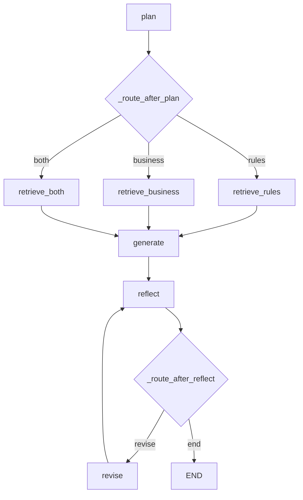

# LangGraph Agentic RAG

`EnterpriseLangGraphAgent` 是项目里从 RAG 过渡到 Agent 的核心类。它不是替代普通 RAG，而是增加一个“会规划、会检索、会反思”的入口。

代码位置：

- `src/langgraph_enterprise_agent.py`
- service 接入：`src/rag_service.py::_langgraph_agent_answer()`
- UI 入口：`检索实现 = langgraph`，`检索增强策略 = langgraph_agent`

## 核心思想

普通 RAG 通常是：

```text
query -> retrieve -> generate
```

Agentic RAG 变成：

```text
query -> plan -> act/retrieve -> observe/context -> generate -> reflect -> revise/end
```

这个项目里的 LangGraph Agent 使用固定状态图，不依赖 OpenAI tool-calling。原因是项目当前 LLM 是百炼/Qwen 的 OpenAI-compatible completion 客户端，使用“LLM 输出 JSON 计划 + Python 节点执行工具”的方式更稳定，也更适合学习。

## State 是共享黑板

状态定义：

- `src/langgraph_enterprise_agent.py::EnterpriseAgentState`

关键字段：

| 字段 | 含义 |
| --- | --- |
| `question` | 用户原始问题 |
| `route` | `rules`、`business`、`both` |
| `search_queries` | Agent 规划出的检索 query |
| `docs` | 检索到的文档，使用 reducer 追加 |
| `context` | 拼接给 LLM 的上下文 |
| `answer` | 当前答案 |
| `critique` | 反思节点给出的意见 |
| `needs_human_review` | 是否建议人工确认 |
| `revision_count` | 已修订次数 |
| `revision_max` | 最大修订次数 |
| `top_k` | 检索数量 |
| `debug_steps` | 节点轨迹，展示在 UI 调试框 |

学习时只要记住：

```text
节点输入 state，节点输出 dict，dict 会合并回 state。
```

## 图结构

核心方法：

- `src/langgraph_enterprise_agent.py::EnterpriseLangGraphAgent._build_graph()`



## 节点说明

| 节点 | 方法 | 输入依赖 | 输出字段 | 作用 |
| --- | --- | --- | --- | --- |
| `plan` | `plan()` | `question` | `route`、`search_queries`、`plan`、`needs_human_review` | 让 LLM 输出 JSON 检索计划 |
| `retrieve_rules` | `retrieve_rules()` | `search_queries`、`top_k` | `docs`、`context` | 检索制度库 |
| `retrieve_business` | `retrieve_business()` | `search_queries`、`top_k` | `docs`、`context` | 检索经营库 |
| `retrieve_both` | `retrieve_both()` | `search_queries`、`top_k` | `docs`、`context` | 同时检索制度和经营库 |
| `generate` | `generate()` | `question`、`context`、`needs_human_review` | `answer` | 基于上下文生成答案 |
| `reflect` | `reflect()` | `question`、`context`、`answer`、`docs` | `critique`、`needs_human_review` | 判断回答是否被上下文支撑 |
| `revise` | `revise()` | `question`、`context`、`answer`、`critique` | `answer`、`revision_count` | 根据反思意见修订答案 |

## 条件边

### `_route_after_plan()`

根据 `state["route"]` 选择检索分支：

```text
rules -> retrieve_rules
business -> retrieve_business
both -> retrieve_both
```

如果 LLM 没输出合法 route，则兜底到 `rules`。

### `_route_after_reflect()`

根据 `critique`、`needs_human_review` 和修订次数决定是否进入 `revise`：

```text
如果 critique 暗示“不足/缺少/没有/未...”，且未超过修订次数，则 revise。
否则 END。
```

## Human in the loop

当前版本没有真正中断流程等待人工输入，而是做了“人工确认标记”。

代码位置：

- `EnterpriseLangGraphAgent.HUMAN_REVIEW_KEYWORDS`
- `EnterpriseLangGraphAgent._is_sensitive()`
- `EnterpriseLangGraphAgent.plan()`
- `EnterpriseAssistantService._langgraph_agent_answer()`

当问题涉及开除、辞退、法律、赔偿、数据泄露、处分等敏感词时，`needs_human_review=True`，最终 debug 中会提示：

```text
human_review: 建议人工确认后再执行。
```

## MemorySaver 和 thread_id

Agent 编译时使用：

```python
graph.compile(checkpointer=self.memory_saver)
```

这意味着每次运行需要：

```python
config={"configurable": {"thread_id": "..."}}
```

代码位置：

- `EnterpriseLangGraphAgent._thread_config()`

当前 UI 没有显式传用户会话 ID，所以默认每次生成一个新的 `thread_id`。后续如果要做多轮 Agent 记忆，可以让 UI 或 service 传入稳定的 `thread_id`。

## 返回结果

Agent 不直接返回 `AnswerPackage`，而是先返回：

- `LangGraphAgentResult`

service 再转换为：

- `AnswerPackage`

这样 UI 不需要知道 LangGraph 内部状态，只展示统一字段。

## 学习重点

学习这个类时不要死背所有节点，先抓住四件事：

1. `EnterpriseAgentState` 定义状态字段。
2. `_build_graph()` 定义节点和边。
3. 每个节点都是 `state -> dict`。
4. 条件边根据 state 决定下一步。

掌握这四点，就能从普通 RAG 过渡到 Agent。
